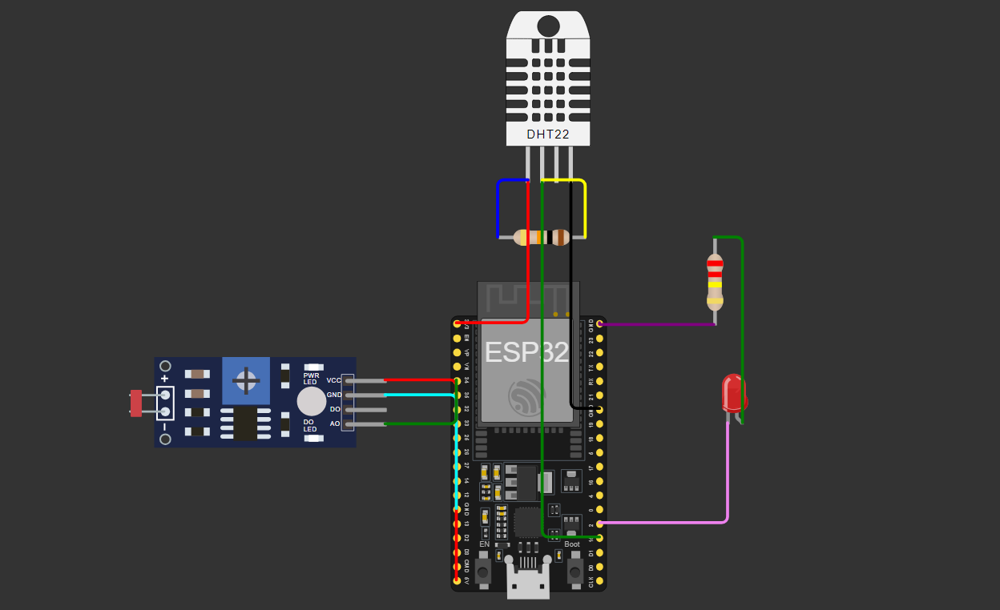

# Monitoramento de Sistema Renovável

## Descrição

Este projeto foi desenvolvido para monitorar e controlar um sistema de geração de energia renovável, utilizando sensores de temperatura, umidade e luminosidade. O principal objetivo é acompanhar as condições ambientais e fornecer alertas quando os parâmetros atingem limites críticos, o que pode impactar na eficiência da geração de energia renovável, especialmente em sistemas solares e eólicos.

O sistema utiliza um **ESP32** para coletar dados dos sensores de temperatura, umidade e luminosidade e publicá-los em um broker MQTT (HiveMQ). O **dashboard em Python** é responsável por exibir esses dados em tempo real e gerar alertas visuais, facilitando o monitoramento contínuo do sistema e permitindo a tomada de decisões informadas para otimizar a geração de energia.

### Utilidade do Projeto

Esse sistema de monitoramento é altamente relevante para a área de **energia renovável**, pois permite que usuários e engenheiros possam monitorar as condições ambientais que afetam diretamente a eficiência de sistemas de geração de energia solar, eólica ou até mesmo hídrica. 

- **Energia Solar**: A intensidade da luz (medida pela luminosidade) e a temperatura do ambiente influenciam diretamente a eficiência dos painéis solares. Temperaturas muito altas ou muito baixas podem reduzir a eficiência dos módulos fotovoltaicos, assim como a falta de luz pode reduzir a produção de energia.
  
- **Energia Eólica**: A temperatura e a umidade do ar podem afetar a eficiência das turbinas eólicas, além de fatores climáticos como ventos fortes ou fracos. Manter essas variáveis monitoradas garante que o sistema opere nas condições ideais.

- **Monitoramento em Tempo Real**: O uso de um **dashboard visual** permite ao usuário ter uma visão clara dos dados e identificar problemas rapidamente. A emissão de **alertas automáticos** ajuda a identificar condições críticas, como temperaturas excessivas ou falta de luz, que podem afetar a produção de energia, possibilitando uma resposta rápida.

## Arquitetura

## Tecnologias Utilizadas

- **Hardware:**
  - **ESP32**: Microcontrolador utilizado para coletar dados dos sensores e enviar para o broker MQTT.
  - **DHT11**: Sensor de temperatura e umidade utilizado para monitorar as condições ambientais.
  - **LDR (Light Dependent Resistor)**: Sensor de luminosidade para medir a intensidade da luz, relevante para sistemas solares.

- **Software:**
  - **Arduino IDE**: Para programar o ESP32 e interagir com os sensores.
  - **Python**: Usado para desenvolver o dashboard de monitoramento em tempo real.
  - **Dash & Plotly**: Bibliotecas Python utilizadas para criar o dashboard interativo com gráficos.
  - **HiveMQ**: Broker MQTT utilizado para a comunicação entre o ESP32 e o dashboard.
  - **Paho MQTT**: Biblioteca Python para conectar ao broker MQTT e receber os dados.

## Funcionalidade do Sistema

- **Coleta de Dados:**
  - O **ESP32** coleta dados de temperatura e umidade usando o **DHT22**, além de medir a intensidade da luz com o **sensor LDR**.
  - Esses dados são enviados para um servidor MQTT (HiveMQ) através de uma conexão segura.

- **Dashboard de Monitoramento:**
  - Um **dashboard** em Python, utilizando **Dash** e **Plotly**, exibe em tempo real gráficos para acompanhar a **temperatura**, **umidade** e **luminosidade** ao longo do tempo.
  - A eficiência do sistema é calculada com base na luminosidade e exibida em um gráfico de eficiência.
  - Alertas automáticos são acionados em condições críticas, como temperaturas extremas ou luminosidade excessivamente baixa ou alta.

- **Alerta de Condições Críticas:**
  - O sistema detecta condições críticas de temperatura (acima de 45°C ou abaixo de 0°C), umidade (acima de 85% ou abaixo de 20%), e luminosidade (muito baixa ou muito alta) e envia alertas.
  - Esses alertas são exibidos no dashboard e também acionam um LED no hardware ESP32.

## Arquitetura do Sistema

1. **ESP32**:
   - Coleta dados dos sensores DHT22 (temperatura e umidade) e LDR (luminosidade).
   - Envia esses dados para o broker MQTT HiveMQ.
   - Aciona o LED em caso de condições críticas.

2. **MQTT Broker (HiveMQ)**:
   - Recebe os dados do ESP32.
   - Transmite esses dados para o dashboard.

3. **Dashboard (Python com Dash e Plotly)**:
   - Recebe os dados via MQTT.
   - Exibe gráficos de temperatura, umidade, luminosidade e eficiência.
   - Exibe alertas em tempo real sobre condições críticas.

## Projeto Simulado no Wokwi

Você pode visualizar a simulação do projeto de monitoramento do sistema renovável no [Wokwi](https://wokwi.com/projects/414916502118856705). A simulação inclui o código do ESP32 interagindo com os sensores de temperatura, umidade e luminosidade, além do envio dos dados para o broker MQTT.

Acesse o link para ver a configuração do hardware e o comportamento em tempo real dos sensores, como se fosse o ambiente real de operação.

  
## Integrantes

- **Arthur Galvão Alves** - RM554462
- **Felipe Braunstein e Silva** - RM554483
  
